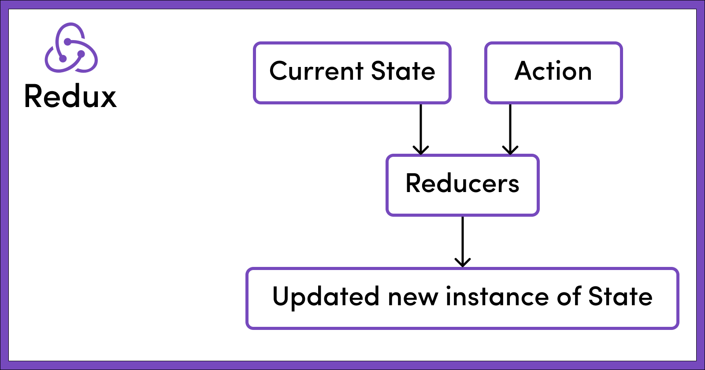

### Welcome To React Redux Cheat Sheet.

# What is redux ?
Redux is a state management library for JavaScript apps. We can use with any JS library or framework like React, Angular, or Vue. it is a global state management library.

#### We use React Redux. So, I will be assuming that you're familiar with React.
<br/>


### Here, We learn react redux fundamentals. 
#### Like:
* Why we will learn redux ?
* Redux Toolkit.
* Core principles of redux.
* Redux three key principles.


# Why we will learn redux ?
Redux is itself a standalone library that is used with any UI library or framework. It can be used with frameworks such as React, Angular, Vue, and vanilla JavaScript. However, Redux and React are commonly used together. 

# Redux Toolkit.
Redux Toolkit is their designed Redux logic. It's creating a Redux app esely. It repeatedly leverages the Redux core, and it provides the necessary packages and functionalities to build a Redux app. Redux Toolkit incorporates the best practices, simplifies Redux tasks, and helps prevent common mistakes when writing Redux applications.

# Core principles of Redux.
Redux is three core principles. 
1) Store. 
2) Actions 
3) Reducers.

### Example of Redux core principles in this image


## 1. What is Store?
A store represents the entire [state tree](https://redux.js.org/understanding/thinking-in-redux/glossary#store) of your application. The only way to modify the state within it is to dispatch an [action](https://redux.js.org/understanding/thinking-in-redux/glossary#action), which encourages the [root reducer function](https://redux.js.org/understanding/thinking-in-redux/glossary#reducer) to recalculate the new state. [More](https://redux.js.org/api/store)

### Example with image


### Example with code
```javascript
import React from 'react'
import ReactDOM from 'react-dom'
import { Provider } from 'react-redux'

import { App } from './App'
import createStore from './createReduxStore'

const store = createStore()

// As of React 18
const root = ReactDOM.createRoot(document.getElementById('root'))
root.render(
  <Provider store={store}>
    <App />
  </Provider>
)
```

```javascript
// this is how the store object structure looks like
{
    noOfItemInCart: 2,
    cart: [
        {
            bookName: "Harry Potter and the Chamber of Secrets",
            noOfItem: 1,
        },
        {
            bookName: "Harry Potter and the Prisoner of Azkaban",
            noOfItem: 1
        }
    ]
}


```
<br/>

## 1. What is Actions?
Action is a function. That is used for changing the state of a store in Redux. Actions are dispatched to the store. And they provide information about the type of operation to be performed. An action has a 'type' property, it is describing the type of action. And contains additional data as needed. [more](https://redux.js.org/understanding/thinking-in-redux/glossary#action)

### Example with image


### Example with code
```javascript
// Rest of the code

const dispatch = useDispatch()

const addItemToCart = () => {
return {
    type: "ADD_ITEM_TO_CART"
    payload: {
        bookName: "Harry Potter and the Goblet of Fire",
        noOfItem: 1,
        }
    }
}

<button onClick = {() => dispatch(addItemToCart())}>Add to cart</button>

// Rest of the code

```

``` javascript
// Action that got created by the action creator addItemToCart()

{
    type: "ADD_ITEM_TO_CART" // Note: Every action must have a type key
    payload: {
        bookName: "Harry Potter and the Goblet of Fire",
        noOfItem: 1,
    }
}

```

<br/>

## 1. What is Reducer ?
Reducer is a function. That determines how the application's state changes. And it dispatches an action to the Redux store. 
It works with the current state and an action. And based on the type of action, it returns the new state.The main purpose of the reducer is to manage state changes. [more](https://redux.js.org/understanding/thinking-in-redux/glossary#reducer)

### Example with image


### Example with code
```javascript

const initialCartState = {    
    noOfItemInCart: 0,          
    cart: []                              
}

// NOTE: 
// It is important to pass an initial state as default to 
// the state parameter to handle the case of calling 
// the reducers for the first time when the 
// state might be undefined

const cartReducer = (state = initialCartState, action) => {
    switch (action.type) {
        case "ADD_ITEM_TO_CART": 
            return {
                ...state,
                noOfItemInCart: state.noOfItemInCart + 1,
                cart : [
                    ...state.cart,
                    action.payload
                ]
            }
        case "DELETE_ITEM_FROM_CART":
            return {
                // Remaining logic
            }
        default: 
            return state  
    }       // Important to handle the default behaviour
}           // either by returning the whole state as it is 
            // or by performing any required logic


```

<br/>

# Installation Redux Toolkit

Redux Toolkit is available as a package on NPM for use with a module bundler or in a Node application:

###### # If you use npm 
```
npm install @reduxjs/toolkit
```

###### # Or if you use yarn
```
yarn add @reduxjs/toolkit
```